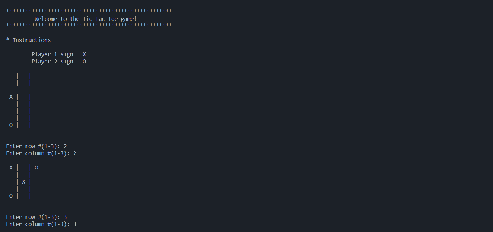
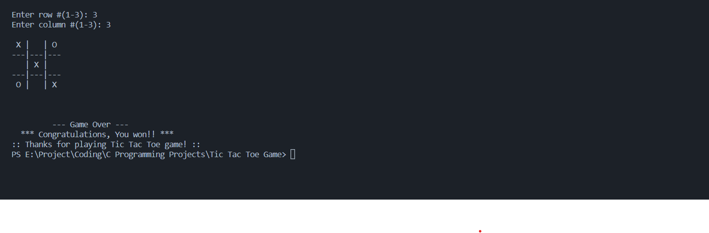

# Tic Tac Toe Game in C

This is a simple Tic Tac Toe game implemented in C programming language. The game is played between a human player and a computer. The board is represented using a 2D array of characters. The player uses the X symbol while the computer uses the O symbol. The game ends when either the player or the computer has three symbols in a row or when the board is full. The winner is determined by checking the rows, columns, and diagonals of the board.

## Features:

- Simple command-line interface
- Randomized computer moves
- Checks for invalid moves by the player
- Determines the winner and prints the outcome of the game

## How to Use
1. Clone the repository or download the number_guessing_game.c file.
1. Compile the program using a C compiler.
1. Run the compiled program in the terminal or command prompt.
1. Follow the prompts to play the game
## Functionality:

- The resetBoard() function initializes the 2D array to empty spaces.
- The printBoard() function prints the current state of the board.
- The checkFreeSpaces() function returns the number of empty spaces on the board.
- The playerMove() function allows the player to enter their move by selecting a row and column on the board. It checks for invalid moves and prompts the player to enter a valid move.
- The computerMove() function generates random moves for the computer as long as there are still empty spaces on the board.
- The checkWinner() function checks for a winner by checking the rows, columns, and diagonals of the board. If a winner is found, it returns the symbol of the winner. If there is no winner, it returns an empty space.
- The printWinner() function prints the outcome of the game based on the winner.

## Game Output Screenshots

